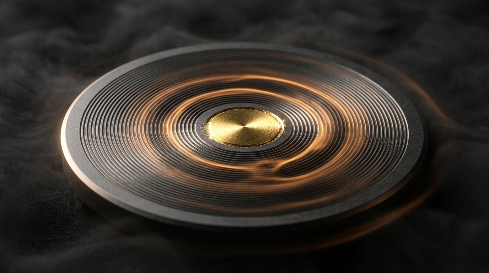

# WAVELINK // Near-Ultrasonic Data Transceiver Platform

<div align="center">



**Air-gapped acoustic communication platform transforming standard audio hardware into an impervious, RF-silent data conduit.**

[](LICENSE)
[](#physical-layer-specifications)
[](#physical-layer-specifications)
[-red.svg?style=flat-square)](#security-architecture)
[](#)

[Live Production Site](https://wavelink-ultrasound-krish.netlify.app) · [Documentation](#architecture) · [Dev Kit Request](#dev-kit-hardware)

</div>

---

## Overview

**WAVELINK** is an enterprise-grade acoustic communications platform engineered for high-security, RF-hostile, and air-gapped operating environments. By modulating data onto near-ultrasonic acoustic carrier waves (18.0–24.0 kHz) just above the human auditory threshold, WAVELINK enables bidirectional device-to-device communication through standard microphones and speakers with zero RF emissions.

### Core Capabilities

- **Zero RF Footprint**: Impervious to RF spectral scanning, EMP blasts, directional antennas, and TEMPEST eavesdropping.
- **Physical Boundary Isolation**: Acoustic signals do not penetrate sealed enclosures or sound-isolated walls, guaranteeing physical perimeter security.
- **Micro-Precision DSP**: Dual-core 32-bit RISC-V digital signal processor with 1024-point real-time FFT acceleration and Doppler-compensating tracking loops.
- **High-Fidelity Web Audio Synthesizer**: Procedural physical tactile feedback and real-time carrier phase synchronization.
- **Global Command Spotlight (`⌘K` / `Ctrl+K`)**: Instant access to hardware diagnostics, 3D exploded CAD views, packet generators, and SDK shortcuts.

---

## System Architecture

```
                                  WAVELINK PHY & DSP PIPELINE
                                  
   +-------------------+      +--------------------+      +----------------------+
   |  Application Data | ---> | CRC-32 + Framing   | ---> | 2-FSK Modulator      |
   |  (Raw Bitstream)  |      | Reed-Solomon Codec |      | Phase Continuous DAC |
   +-------------------+      +--------------------+      +----------------------+
                                                                     |
                                                                     v
   +-------------------+      +--------------------+      +----------------------+
   | Reconstructed Bit | <--- | Demodulator + PLL  | <--- | 1024-Point FFT       |
   | Payload (Air-Gap) |      | Matched Filter DSP |      | Near-Ultrasonic MIC  |
   +-------------------+      +--------------------+      +----------------------+
```

### Physical Layer Specifications

| Parameter | Specification | Tolerance / Standard |
|---|---|---|
| **Carrier Frequency Band** | 18.0 kHz – 24.0 kHz | $\pm 0.05 \text{ kHz}$ Center Tuning |
| **Modulation Scheme** | Continuous-Phase 2-FSK | Coherent Matched-Filter Detection |
| **Max Throughput** | 16.4 kbps | Uncompressed Binary Framing |
| **Frame Latency** | 12 ms – 18 ms | Standard 64-byte payload |
| **Effective Range** | 0.5 m – 3.2 m (Air) / 1.5 m (Solid) | $FSPL_{ac} \approx 20\log_{10}(d) + \alpha d$ |
| **Noise Immunity** | +32.4 dB SNR Dynamic Range | Adaptive Threshold Tracking |
| **Forward Error Correction** | Reed-Solomon RS(255, 223) | Recovers up to 16 corrupted bytes |

---

## Interactive Hardware & Simulation Suite

The platform includes a comprehensive hardware simulation and telemetry diagnostic suite:

1. **Photorealistic Scrollytelling**: 8K macro studio hardware visualization with optical depth-of-field transitions across all 7 protocol stages.
2. **360° Free-Orbit Inspector (`[FREE 3D]`)**: Unlocks full spatial 3D inspection of the PZT-5H transducer assembly.
3. **6-Layer Exploded CAD Teardown (`[EXPLODE CAD]`)**: Animated layer separation displaying the titanium chassis, elastomer gasket, piezo diaphragm, focus bezel, and sputtered gold nodes.
4. **Real-Time I/Q Phase Constellation**: Visualizes in-phase and quadrature trajectories with real-time Error Vector Magnitude (EVM) calculation.
5. **Live Air-Gap Packet Transmission Sandbox**: 2-FSK tone generation with byte-by-byte CRC-32 reassembly and spectral verification.
6. **Acoustic Link Budget Modeler**: Physics engine modeling free-space acoustic loss, thermal dissipation, and bit error probability.
7. **RF EMP & Jamming Resistance Sandbox**: Stress-tests resilience against RF EMP blasts and ambient acoustic noise.
8. **Interactive Firmware CLI REPL**: Full developer terminal for real-time register reading, frequency tuning, and packet injection.

---

## Quickstart

### Prerequisites

- Node.js $\ge 18.0.0$
- npm $\ge 9.0.0$

### Installation & Local Run

```bash
# Clone repository
git clone https://github.com/KR-007J/wavelink-ultrasound.git
cd wavelink-ultrasound

# Install dependencies
npm install

# Launch development server
npm run dev
```

### Building for Production

```bash
npm run build
```

---

## Developer SDK Integration

### Embedded C / Rust Firmware Quickstart

```c
#include "wavelink.h"

int main(void) {
    // Initialize WAVELINK acoustic transceiver ASIC
    wavelink_config_t config = {
        .carrier_freq_khz = 20.4f,
        .baud_rate = 16400,
        .fec_enabled = true,
        .crc_mode = WL_CRC32_IEEE
    };
    
    wavelink_handle_t* dev = wavelink_init(&config);
    
    // Transmit encrypted air-gapped payload
    uint8_t payload[] = "AIRGAP_AUTH_TOKEN_0x9F";
    wavelink_transmit_frame(dev, payload, sizeof(payload));
    
    return 0;
}
```

---

## Keyboard Shortcuts

| Shortcut | Action |
|---|---|
| `⌘K` / `Ctrl+K` | Open Universal Command Spotlight |
| `G + H` | Jump to Overview |
| `G + M` | Jump to Mechanics / DSP Lab |
| `G + S` | Jump to Enterprise Showcase |
| `G + D` | Jump to Developer SDK & CLI |
| `E` | Toggle Exploded 3D CAD Assembly |
| `O` | Toggle 360° Free Orbit Mode |
| `T` | Transmit Test Packet Burst |
| `ESC` | Close Modals & Overlays |

---

## License

This project is licensed under the MIT License — see the [LICENSE](LICENSE) file for details.
